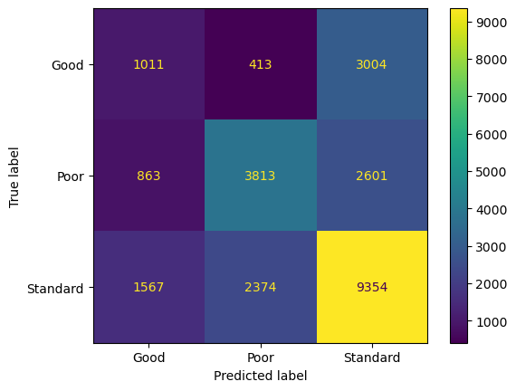
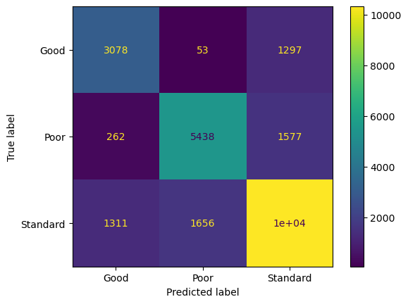
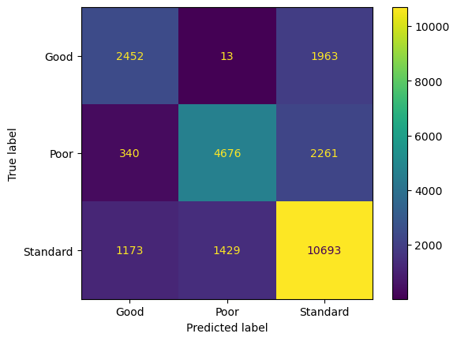

# 274481
# TITLE: 
Credit Prediction

# MEMBERS: 
Alberto de Leo (274481), Alessia Pazzaglia (269441), Matteo Policastro (276761)

# DESCRIPTION: 
The aim of this project is to divide the users of the greatest financial company in the world into three credit score brackets: Poor, Standard and Good. This company has collected bank details and credit-related information from all over the globe, so our goal is to help it developing targeted products for each group.

# APPROACHES:
The first things we should do is the "data engineering and labeling". 
We can assume that all the data are usable (we have the license to use and study them), reliable, sizeable (enough for our scope) and accessible. 
We also have to take care of how much noisy these data are, so we have to clean them by removing all the outliers, that are extreme values that differ from most other data points in our dataset.
Then we have also dropped the column id as we thought that was not usefull in building the models.
Then we should give a look to our data, in order to see how values are correlated, their statistical information (mean, standard deviation etc.) and their trends  in order to have a better understanding of the problem.
After having done the EDA, we can now start analysing all the possibilities that we have in order to solve the problem. Since we have to predict a target it is a **classification problem**. 
All the methods we can use are:
-	KNN
-	CART
-	Random Forest
-	Logistic Regression
-	Kernel Svc
-	Artificial Neural Network

We can **not** consider Logistic Regression, as between our data there is not a linear relationship. But in order to decide which one is better we should analyse all the features of each model (Performance, Metric, Interpretability, Tuning Parameters).

**KNN** has not a good performance as it is slower as it must compute the neighbours and all the distances between the data and the neighbours, metric and interpretability are good as in order to understand the output we should just look at its neighbours. Tuning is pretty simple as we do need to tune just the number of neighbours, the type of distance and the weights.

**CART** has a good performance if the dataset is small which means that is a lot fast. It has a good metric and a fantastic interpretability as the only thing to do is to follow the splits and the output will be clear. Tuning is not so good, as we need to take care of a lot of hyperparameters in order to have good metrics.

**RANDOM FOREST**, it seems that all the parameters that we are using are not so good as it is very slow as it has to prepare a lot of carts using a random method. Moreover, due to this fact, it is not even interpretable as the output will be the agglomeration of more decision trees. Unlikely in this model we have a lot to tune, as the depth of the tree for example, but this leads to an accurate model, this is why metrics are very good.

**KERNEL SVC** seems to be good mostly on the tuning as we do not really need to tune a lot of hyperparameters. On the other hand, it is not interpretable as the output comes from a formula, this is why we cannot understand it. We can also notice that this model has good metrics and it is really quick.

**ARTIFICIAL NEURAL NETWORKS (ANN)** are very slow in the training as we need to let the method calculate and minimize the weights in the hidden layers, but this forward and backpropagation pattern that ANN uses, leads to a very good metric, so most of the times accuracy is very high. In order to obtain such a good result we also need to tune some parameters, as the inputs, how many hidden layers, how many epochs, the function that we want to apply, which is a long process and so it is not as good. Interpretability is really really bad as we do not know how the weights are adjusted and why, so the final output cannot be explained in a clear way.

After having noticed all this, we can state that we should use as the aim of our problem is to be accurate and possibily in the less time possible:
-	XGBOOST
-	KERNEL SVC
-	KNN
-	ANN

(This last method can be added as fourth, as the accuracy is expected to be really high, even if it takes some time, which in our problem is important, but not as much as the precision of the output).

Then we started with the splitting between training, validation and test set. We have to split data in three parts:
-	*Training*, used to train the model. It is the set of data that is used to train and make the model learn the hidden features/patterns in the data. 70-80%
-	*Validation*, to tune the model. Not seen by the algorithm, used to estimate the performance of different algorithms. The validation set is a set of data, separate from the training set, that is used to validate our model performance during training. This validation process gives information that helps us tune the model's hyperparameters and configurations accordingly.
-	*Test*, to test its performance. Not seen by the algorithm, it evaluates the performance of the model. 20-30%
But partitioning is not that easy, as we cannot always use the randomization, in some cases we need the group partitioning in order not to train on the test or validation data. 
 > REMEMBER TO NEVER TRAIN ON THE TEST DATA!!! 

For this reason, after having divided our data in training and test sets, we can fill the null values, in order not to know in advance these missing values. These will be replaced using the Imputation, and filling the missing values with another value based on a reasonable estimate. We decided to substitute the null values using the mean if the variable was numerical and with the mode if the variable was categorical.
Then, another important step that we should not forget is: *Featuring*! It is the process of transforming a raw example into a feature vector:
-	One-hot encoding: creates the dummy variables and so each category value is converted into a new column and assigned a 1 or 0 (notation for true/false) value to the columns;
-	LabelEncoder: it involves converting each value in a column to a number; 
- Standardscaler: in order to standardize and normalize numerical variables;

# EXPERIMENTAL DESIGN:
We have tried to build the classifiers using the built-in functions, and in each of them we used the grid search, which is a technique for tuning hyperparameters. In fact, we have inserted some values for the parameters we wanted optimize and this method tries all the combinations.

## EVALUATION METRICS:
We have decided to look for accuracy as it is used when the goal of the model is to identify how may items were correctly classified. Moreover, we prefer looking at accuracy as we have a dataset that is pretty balanced.
Remember that the F1 score is balancing precision and recall on the positive class while accuracy looks at correctly classified observations both positive and negative.

## Tuning:

In the **Kernel SVC** we decided to tune the *kernel*, with the choices of 'linear' and 'rbf'. Then we tuned also the *'C'* that is the regularization parameter and we chose the range 
[0.1 ,1] and finally, since this model was taking *definitely too long*, we decided to put *'max_iter'* in order to let the process stop at the 2000 iteration even if it had not converged yet.

For the second model (**XGBOOST**), we had some parameters to tune, as: *'max_depth'* which indicates the maximum depth of a tree. Increasing this value will make the model more complex and more likely to overfit. Then *'lambda'* which is a L2 regularization term on weights, *'alpha'*, is a L1 regularization term on weights.
Finally, *'colsample_bytree'*, represents the subsample ratio of columns when constructing each tree, *'learning_rate'* is loguniform distribution and then *'min_child_weight'*, is the minimum sum of instance weight (hessian) needed in a child.
From these tries we discovered that having too much hyperparameters to tune using the grid search was taking too much time, so we adjusted them *focusing on the most important ones*, so 'max_depth' and 'learning_rate'.

In the **KNN** model we had to tune, using the grid search, 'n_neighbors' and so the number of neihgbors it had to take into account, the 'metric': 'manhattan', 'euclidean', 'cosine' and the 'weights' in order to decide the influence of each neighbour, it can be 'uniform' (every neighbour has the same influence) or 'distance' (the closer are the most important).

Finally, in the **Artificial Neural Network**, we have tuned the activation function, which is the function that 'activates' the neurons and it is useful to bring non-linearity in the network. Moreover, we have tuned the 'learning_rate_init' which controls the step-size in updating the weights and the number of hidden layers as well as the number of nodes for each level.

# RESULTS:
After having trained the model we tested it. From this we have discovered that:
## KERNEL SVC:

## XGBOOST:

## KNN:

## ANN:

## FROM THESE RESULTS:
From our intuition we expected that the best model should have been the **XGBOOST** but looking at the result it came out that in our case the **KNN** yields better outcome.
Looking at *metrics* the accuracy of the models is as follows:
-   Kernel SVC: 57%;
-   XGBoost: 75%;
-   KNN: 77%;
-   ANN: 71%.

While if we are interested in *timing* we can underline the fact that:
-   Kernel SVC: 50 minutes;
-   XGBoost: 2 hours;
-   KNN: 1 hour and 30 minutes;
-   ANN: 2 hours and 50 minutes.

 In order to decide which model to use in order to solve most efficiently our problem we should look at the metric, as we need accurate results rather than in a short time (even if the model cannot take weeks for running as data can change and then becoming no more reliable). 
This is why it is better to use **KNN**.

## OUR OPINION:
We were not expecting such result as we thought that XGBOOST model would perform better in problems with tabular data (data that are organized in a table with rows and columns). However, KNN's performance for both timing and metric is not too far from the one of XGBOOST. 